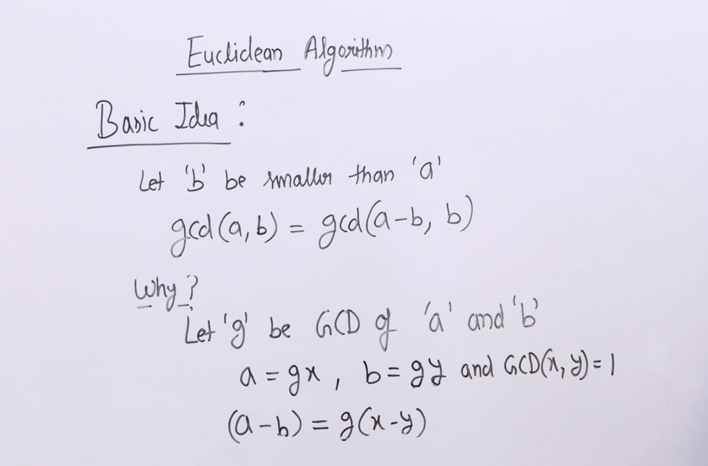
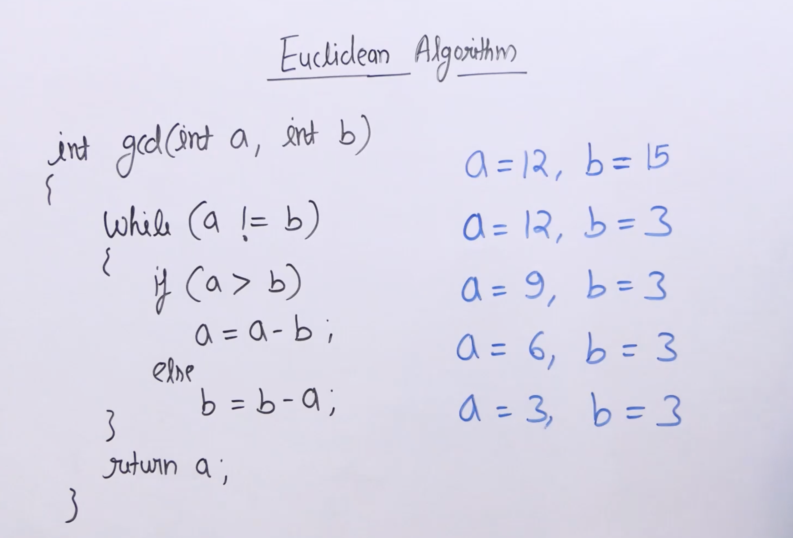
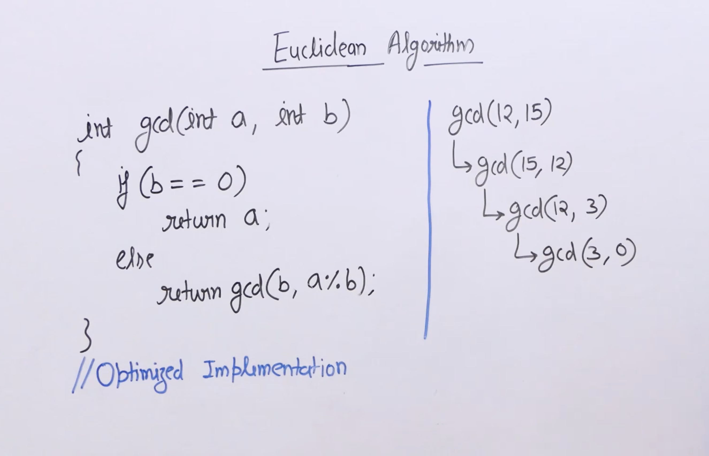

# Euclidian Algorithm
- GCD (Greatest Common Divisor) or HCF (Highest Common Factor) of two numbers is the largest number that divides both of them.



- A simple and old  approach is the **Euclidean algorithm by subtraction**



>[!Example] Example
```cpp
#include<iostream>
using namespace std;

int gcd(int a, int b){
	if (a == 0) return b;
	if (b == 0) return a;
	if (a == b) return a;
	if (a > b) return gcd(a - b , b);
	return gcd(a, b - a);
}

int main(){
	int a = 98, b = 56;
	cout<<"GCD of "<<a<<" and "<<b<<" is "<<gcd(a, b);
	return 0;
}
```

-  Instead of Euclidean algorithm by subtraction, a better approach is present. We don’t perform subtraction here. we continuously divide the bigger number by the smaller number.



>[!Example] Example
```cpp
#include <iostream>
using namespace std;

int gcd(int a, int b){
	return b == 0 ? a : gcd(b, a % b);
}

int main(){
	int a = 98, b = 56;
	cout<<"GCD of "<<a<<" and "<<b<<" is "<<gcd(a, b);
	return 0;
}
```


- a x b = LCM(a, b) * GCD (a, b)
- LCM(a, b) = (a x b) / GCD(a, b)
