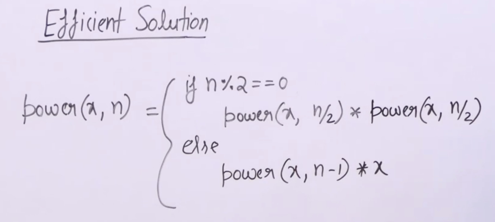

## Naive Method
```cpp
int computePower(int base, int exponent){
    int result = 1;
    if(exponent == 0) return result;
    if(exponent == 1) return base;
    for(int i = 0; i < exponent; i++){
        result *= base;
    }
    return result;
}
```



## Efficient Method
```cpp
int power(int base, int exponent){
    if(exponent == 0) return 1;
    int temp = power(base, exponent/2);
    temp *= temp;
    if(exponent % 2 == 0) return temp;
    else return temp * base;
}
```