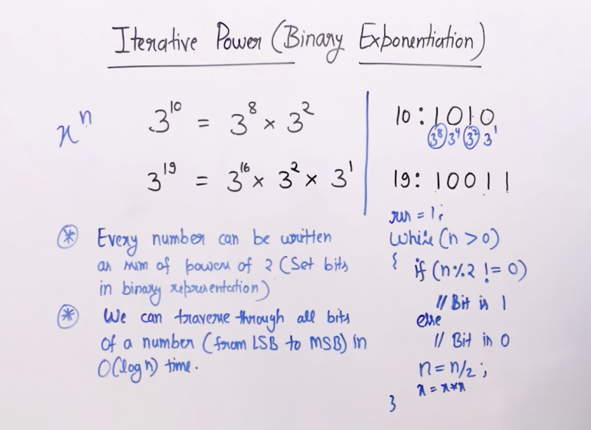

## Iterative Power (Binary Exponentiation)



```cpp
int power(int base, int exponenet){
	int res = 1;
	while(exponent > 0){
		if(exponent % 2 == 0) res *= base;
		base *= base;
		exponent /= exponent;
	}
}
```