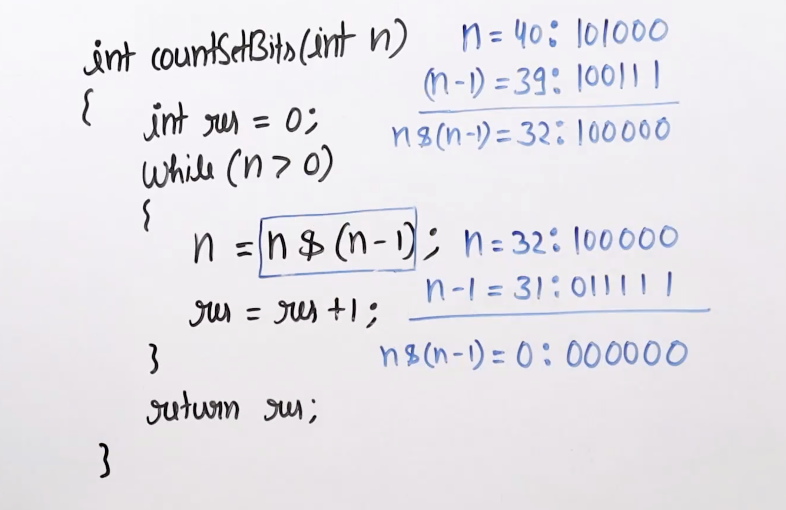

>[!Question] Count set bits of a number.


## Naive Solution

```cpp
int countSetBits(int n){
    int res = 0;
    while(n>0){
        res += res + (n&1);
        n/= 2;
    }
    return res;
}
```

##  Brian Kerningum's Algorithm



```cpp
int countSetBits(int n){
	int res = 0;
	while(n>0){
		n = n & (n - 1);
		res += 1;
	}
	return res;
}
```
