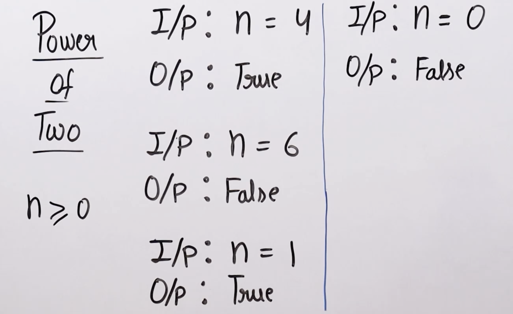

>[!Question] Check weather the number is power of two or not.



## Naive Solution
```cpp
bool powerTwo(int n){
	if(n==0) return false;
	while(n!=1){
		if(n&1) return false;
		n/=2;
	}
	return true;
}
```

5&2

## Efficient Solution
```cpp
bool powerTwo(int n){
	if(n == 0) return false;
	return ((n&(n-1)) == 0);
}
```

## More Efficient Solution
```cpp
bool powerTwo(int n){
	return ((n&(n&(n-1))) == 0);
}
```
